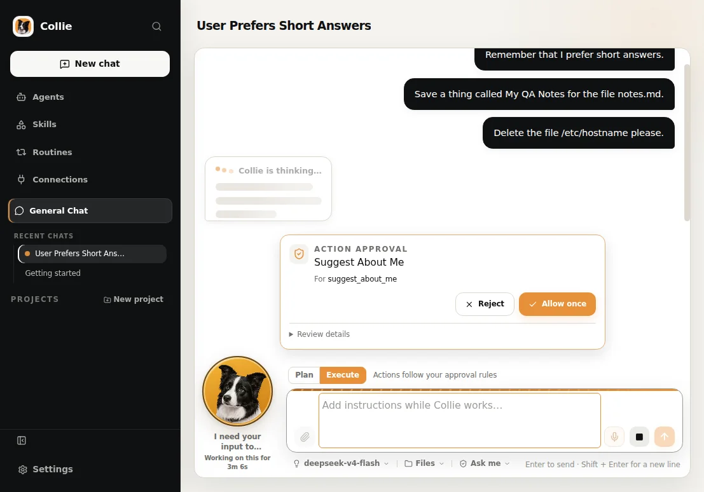
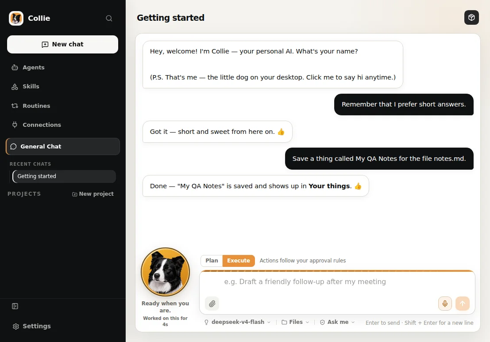
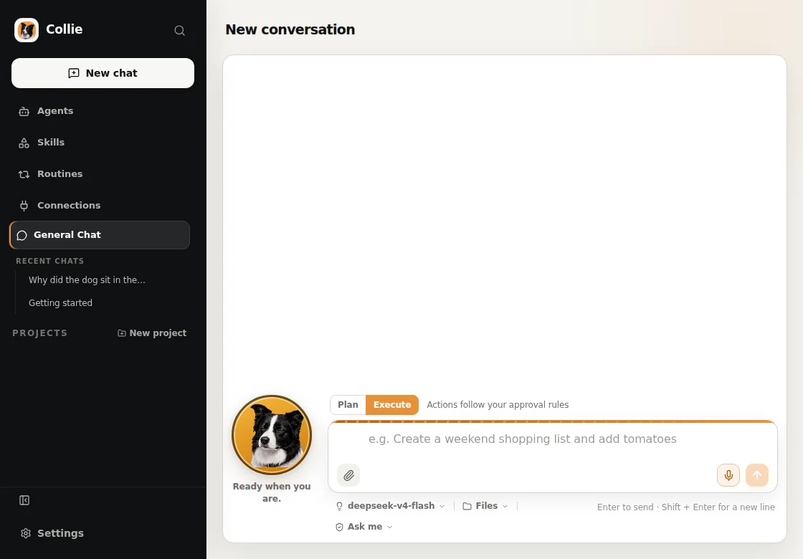
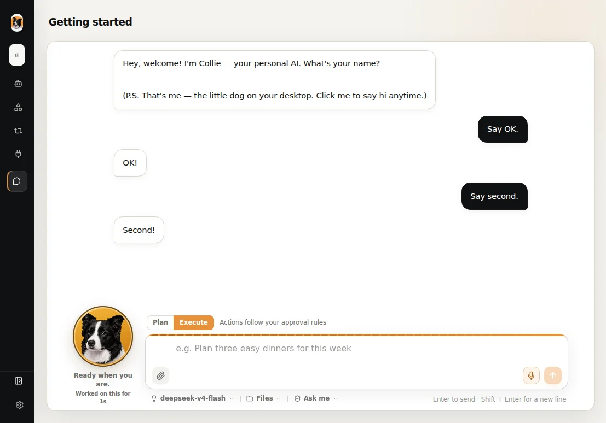
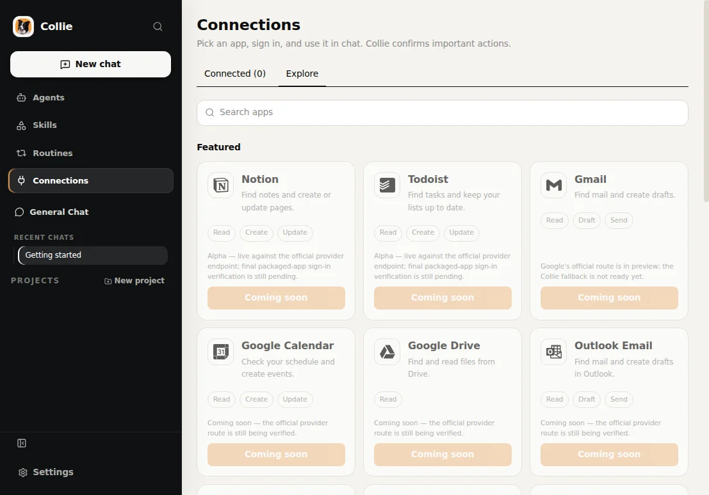

<p align="center">
  
</p>

# Collie — your personal AI. With a dog. 🐾

**Collie is the first AI harness for non-coders**: a friendly, local-first
personal AI for Windows, macOS, and Linux that turns plain-English requests
into real, reviewable work — and keeps you in control the whole way. No
terminal. No prompt engineering. No forced subscription.

<p align="center">
  <a href="LICENSE"></a>
  <a href="https://github.com/FoxRick/Collie/releases"></a>
  <a href="https://github.com/FoxRick/Collie/releases"></a>
  <a href="https://github.com/FoxRick/Collie/actions/workflows/ci.yml"></a>
  <a href="https://heycollie.com"></a>
  <a href="https://github.com/FoxRick/Collie"></a>
</p>

> **Alpha release** — this repo ships a published **alpha** (`v0.1.0-alpha.7.3`)
> with installers for **Windows (x64), macOS (ARM64), and Linux (x64)**, plus
> the full source. It's a real product you can install and talk to — but it's
> early, so expect rough edges. The `main` branch is slightly ahead of the
> published release with the newest daily features. Grab an installer from
> [heycollie.com/download](https://heycollie.com/download) (recommended) or
> [GitHub Releases](https://github.com/FoxRick/Collie/releases), and star the
> repo to follow along. Join the waitlist at
> [heycollie.com](https://heycollie.com) to hear about every new release first.

## Screenshots

<table>
<tr>
  <td align="center"><br><b>Plans, thinking, and approvals</b><br>Broad requests become reviewable plans; risky actions ask first.</td>
  <td align="center"><br><b>Every deliverable, in one place</b><br>Files, summaries, and results land in a "Your things" panel.</td>
</tr>
<tr>
  <td align="center"><br><b>A friendly companion</b><br>A Border Collie lives in your corner — friendly, never in charge.</td>
  <td align="center"><br><b>Collapsible sidebar</b><br>Collapse to a slim icon rail to give the chat more room.</td>
</tr>
<tr>
  <td align="center"><br><b>Connect the services you use</b><br>Pick an app, sign in, and use it in chat. Unverified ones say so.</td>
  <td align="center"><em>More screenshots as the app grows.</em></td>
</tr>
</table>

## What is Collie?

Collie is a chat-first personal AI that lives on your computer. You talk to it
the way you'd talk to a smart friend, and it quietly handles the technical
parts underneath:

- **It plans before it acts.** Big or broad requests become short, reviewable
  plans you can read and approve before anything happens.
- **It asks before risky things.** Deleting, sending, paying, publishing, or
  touching your data always goes through a central approval gate — no matter
  how friendly the chat gets.
- **It uses *your* AI — not a subscription.** Sign in with your existing
  ChatGPT or Claude account, paste an API key (DeepSeek, OpenRouter, Groq,
  and any OpenAI-compatible provider), or use a local model. No mandatory
  Collie account, no forced monthly fee.
- **It remembers — on your machine.** Collie keeps its notes, settings, and
  history locally. Nothing is silently shipped off your device.
- **It has a dog.** A Border Collie lives in the corner of your screen, with
  moods and reactions of its own. (Friendly, but never in charge — the
  permissions always are.)

Collie is built for people who want the leverage of agentic AI *without* the
terminals, API keys, MCP servers, or prompt-engineering vocabulary. Experts
are welcome too — but the normal path never requires them.

## Complete feature list

**💬 Chat & conversation**

- Chat-first by design — streamed conversations with history and
  attachments; no prompt syntax, no templates to learn
- **Skeleton streaming** — you see Collie thinking as it writes, instead of a
  frozen spinner
- **Quick-recap cards** — long answers end with a short summary card of what
  just happened, so you always know where you are
- **"Remember" pill** — Collie visibly shows you when it stores something new
  about you
- **Starter conversation** — on first run Collie greets you, learns your
  name, and you're talking; `/get-started` if you want a tour
- **Chat-stream polish** — smoother, calmer streaming as replies build.

**🧠 Real work, reviewed**

- Plain-English requests become **multi-step plans** you read and approve
  before anything runs
- Central **approval gate** for every consequential action — destructive,
  financial, external writes, sends, and publishing are never silent
- **Per-folder file consent** — grant Collie access to exactly the folders it
  needs; in-scope work runs smoothly, everything else asks first
- **One-tap undo** for every local file change — writes are journaled and
  reversible
- **"Your things" panel** — every deliverable (documents, spreadsheets,
  files, summaries) lands in one reviewable place, named in plain language
- **Subagent observability** — watch live agents working, then get a friendly
  pet popup when they settle
- **Gardener mode** — Collie proposes improvements to its own instructions
  and memory, always as a reviewable, reversible change

**🔌 Bring your own AI**

- Sign in with your existing **ChatGPT or Claude** account
- Paste any **API key** — DeepSeek, OpenRouter, Groq, and any
  OpenAI-compatible provider
- Use a **local model** via Ollama
- **Optional Collie account** — sign in from Settings in your system browser
  (password or magic link); it's identity only, and your chats and files stay
  on your machine
- Bundled **models.dev catalogue** — every provider and model at your
  fingertips, auto-refreshed weekly
- Switch models anytime, right from the chat; connections are validated
  before you start

**🧩 Connectors & services**

- **Five official connectors are available to connect in alpha**: Notion,
  Linear, Todoist, Atlassian, and Airtable
- A curated connector catalogue — every other entry honestly labeled
  *Coming soon* until it passes real-account verification
- A flexible connection model (recipes → definitions → connections) that can
  add compatible MCP servers without a Collie release
- Google and Microsoft service bundles in progress

**📱 Collie wherever you are**

- **Telegram messenger** with sender pairing — talk to Collie from your phone
- WhatsApp, Slack, and Discord companions designed and on the way

**⚡ Everyday tools, built in**

- Files, weather, reminders, and memory — local capabilities that need no
  extra accounts
- **Routines & automations** — scheduled tasks that always ask before acting
- **Skills & specialist agents as plain-text files** — read, edit, and share
  them; no programming required

**🎨 Made for humans**

- A **Border Collie companion** for your desktop — moods and reactions;
  friendly, never in charge
- **Collapsible sidebar** — an icon rail that gives chat more room
- Fast, calm desktop app — Electron + React
- **Voice input/output** on the way

**🛡️ Safety & reliability**

- **Local-first everything** — memory, settings, and history in local SQLite;
  no mandatory account, no silent uploads. The optional Collie account only
  verifies your identity (hosted by Supabase) — chats, files, and history
  stay on your machine.
- Permissions engine with a broker → classifier → evaluator → store pipeline
- **Rollback-safe updates** — a new version must boot healthy, or Collie
  rolls back to the last good one
- Automatic **recovery from out-of-memory and renderer crashes**
- **CI-qualified releases** — tagged releases pass documented clean-machine
  and immutable-artifact checks
- **Feedback built in** — report a problem or a suggestion from inside the
  app, and it's routed and tracked.

## What you can do with it

| | |
|---|---|
| **💬 Chat about anything** | Streamed conversations with history and attachments. Ask for help, delegate a task, or just talk. |
| **🧠 Real work, reviewed** | Collie turns plain-English requests into multi-step work with visible progress and reviewable plans. |
| **🛡️ Approval where it matters** | Consequential actions — destructive, financial, external writes, sends, publishing — stay centrally gated and approved by you. |
| **↩️ Undo anything** | Local file changes are journaled — one tap reverts them. |
| **📦 Your things, in one place** | Every deliverable lands in a reviewable "Your things" panel, named in plain language. |
| **✨ Sees you thinking** | Skeleton streaming, quick-recap cards, and the "remember" pill keep you oriented. |
| **📝 Agents, skills & routines as files** | Specialist agents, skills, and routines are plain-text files you can read, edit, and share — no programming required. |
| **🧩 Connect the services you use** | Five official connectors are available to connect in alpha (Notion, Linear, Todoist, Atlassian, Airtable); every other catalogue entry stays labeled **Coming soon** until it passes verification. |
| **📱 Collie on your phone** | Talk to Collie from Telegram, wherever you are. WhatsApp, Slack, and Discord companions are designed and on the way. |
| **📁 Everyday tools built in** | Files, weather, reminders, memory, and more — local capabilities that work without extra accounts. |
| **🔁 Stays current** | Rollback-safe built-in updates arrive in the app, no reinstalls. |

## Built on nanobot 🧬

Collie's Python engine is an **adapted fork of
[nanobot](https://github.com/HKUDS/nanobot)** (MIT) — the ultra-lightweight,
open-source, self-hosted personal AI agent framework by HKUDS. We inherited
its agent loop, providers, tools, MCP client, and WebSocket transport, keep
the vendored engine surgical, and preserve the upstream namespace so
improvements can flow both ways. Attribution and third-party notices live in
[collie-core/THIRD_PARTY_NOTICES.md](collie-core/THIRD_PARTY_NOTICES.md).

## Getting started

### 1. Get Collie

Collie ships installers for **Windows (x64)**, **macOS (ARM64)**, and
**Linux (x64)** on the alpha channel. Download the one for your machine from
[heycollie.com/download](https://heycollie.com/download) (recommended) or from
[GitHub Releases](https://github.com/FoxRick/Collie/releases) — the Release
also carries `SHA256SUMS.txt` and provenance records. Restore from a checksum
if you like to verify before installing. The full source is here too (see
[From source](#from-source-for-developers)).

> The macOS build is **unsigned** during alpha (notarization needs an Apple
> Developer certificate), so you'll approve it on first run. Collie's
> built-in updater rolls new versions back automatically if they don't boot
> healthy.

### 2. Connect your AI

Collie needs a model provider to think with — bring your own, no Collie
account required:

- **Sign in** with your existing ChatGPT or Claude account, or
- **Paste an API key** — DeepSeek, OpenRouter, Groq, and other
  OpenAI-compatible providers, or
- **Use a local model** such as Ollama.

Collie validates the connection and tells you what it found — *"DeepSeek
connected and selected."* — and you can change models anytime from the chat.
There's also an optional free Collie account (Settings → **Account**) for
identity — it's never required, and your chats and files stay on your
machine.

### 3. Just talk

That's it. Collie greets you, asks your name, and remembers it. You don't
write prompts, learn syntax, or configure anything technical first — you just
start talking, and Collie figures out the rest.

## From source (for developers)

The alpha installers are built on **Windows (x64)**, **macOS (ARM64)**, and
**Linux (x64)**; the app also builds and runs from source on Linux for
development. You need Python 3.12, Node.js, and npm:

> Versioning note: the repo carries two versions that move independently —
> the desktop app (`collie-ui/package.json`, e.g. `0.1.0-alpha.7.3`) and the
> Python core (`collie-core/pyproject.toml`, e.g. `0.2.2`). A release tag
> tracks the app version.

```powershell
cd collie-core
py -3.12 -m venv .venv
.\\.venv\\Scripts\\python.exe -m pip install --upgrade pip
.\\.venv\\Scripts\\python.exe -m pip install -e ".[dev]"
.\\.venv\\Scripts\\python.exe -m pytest tests -q
.\\.venv\\Scripts\\python.exe -m ruff check nanobot collie_core tests

cd ..\\collie-ui
npm ci
npm test
npm run typecheck
npm run build
npm run dev
```

Do not publish an installer from a local `dist` directory: release candidates
must pass the documented clean-machine and immutable-artifact checks in
[docs/operations/release/](docs/operations/release/).

## Architecture

```text
collie-core/   Python 3.11+ runtime (adapted from nanobot)
  ├─ agent loop, providers, tools, MCP client, WebSocket transport  (vendored nanobot)
  ├─ permissions engine — broker → classifier → evaluator → store
  ├─ SQLite settings & memory — local-first, no account
  ├─ services + OAuth, connectors catalogue, routines & automations
  ├─ subagents, plans, Gardener, voice, desktop Border Collie pet
  └─ IPC server (localhost WebSocket) + Telegram messenger

collie-ui/     Electron + React 19 + Tailwind 4 (electron-vite)
  ├─ electron-builder + electron-updater (rollback-safe)
  └─ scripts/stage-core.cjs bundles the Python runtime into the app
```

## Documentation

The public docs live in this repository — start at
[docs/README.md](docs/README.md):

- [Vision](docs/VISION.md) — what Collie is for, and the principles behind it
- [Project map](docs/PROJECT_MAP.md) — repository layout and data flow
- [Security & approval matrix](docs/engineering/security/approval-matrix.md)
  — what needs approval, and why
- [Security policy](SECURITY.md) — how to report a vulnerability
- [Release information](docs/operations/release/README.md) — release status
  and artifact validation
- [Contribution guide](CONTRIBUTING.md)

## Roadmap

Public releases and announcements go through [heycollie.com](https://heycollie.com)
first; the active product decisions live in [docs/product/](docs/product/).
Honest status of what's next:

- **Shipped (alpha):** installers for Windows/macOS/Linux with rollback-safe
  updates and crash recovery; Gardener self-improvement mode; "Your things"
  panel; one-tap undo for file changes; per-folder file consent; collapsible
  sidebar; subagent observability; skeleton streaming, quick-recap cards, and
  the remember pill; the Border Collie companion; onboarding (paste-key connect
  + models.dev catalogue + starter conversation); five connectors (Notion,
  Linear, Todoist, Atlassian, Airtable); Telegram messenger; optional Collie
  account sign-in (identity only, browser magic-link); in-app feedback.
- **In progress (gated / not yet available to users):** a hosted "Collie AI"
  managed model route (implemented, disabled by default, pilot only — no
  public endpoint yet); requester-owned shared sessions across computers
  (implemented behind release flags, needs sign-in + hosted acceptance);
  Google and Microsoft service bundles (pending Collie-owned OAuth app
  registrations); voice.
- **Planned / not started:** notarized macOS builds; subscription billing.

## Contributing

Thanks for helping build Collie! For bugs and feature ideas, open an
[issue](https://github.com/FoxRick/Collie/issues) — search first, and never
report vulnerabilities in public issues (use [SECURITY.md](SECURITY.md)).
For changes, read [CONTRIBUTING.md](CONTRIBUTING.md) and the workspace
instructions in [AGENTS.md](AGENTS.md) before you start. Keep claims honest:
a provider, connector, installer, or release is only "available" after its
verified acceptance checks pass.

## Repository layout

```text
collie-core/           Python runtime: agent loop, tools, approvals, memory, tests
collie-ui/             Electron/React desktop app and packaging
docs/                  Product, engineering, and release documentation
```

The public website is maintained separately (its source is intentionally not
part of this repository).

## License

MIT — see [LICENSE](LICENSE) and [NOTICE.md](NOTICE.md) for the full terms and
the separate treatment of Collie branding, artwork, and third-party marks.
The Python engine includes adapted code from
[HKUDS/nanobot](https://github.com/HKUDS/nanobot) (MIT); attribution and
third-party notices are in
[collie-core/THIRD_PARTY_NOTICES.md](collie-core/THIRD_PARTY_NOTICES.md).
