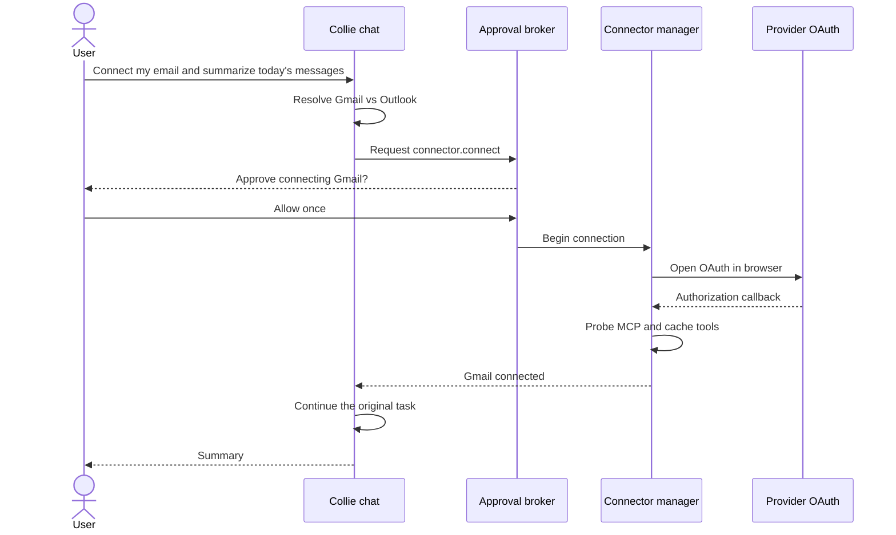

# Connectors: research and implementation plan

Status: in progress — five official MCP routes live as alpha; packaged-provider acceptance pending

Date: 2026-07-29

Audience: product, design, frontend, backend, security, QA

Implementation checkpoint (2026-08-02) — alpha enablement:

- Notion, Linear, Todoist, Atlassian, and Airtable flipped from `coming_soon`
  to `available=True` (`release_status="alpha"`); they now run the real
  OAuth + probe + runtime-bind path (see `feat/connectors-live`);
- Linear, Todoist, and Airtable verified live: RFC 9728 protected-resource
  discovery, PKCE S256, and an OAuth authorization-server
  `registration_endpoint` (dynamic client registration — no Collie-owned
  OAuth app required). Airtable advertises
  `https://airtable.com/oauth2/v1/register` via
  `airtable.com/.well-known/oauth-authorization-server`. Notion and
  Atlassian sit behind Cloudflare (datacenter IP blocked from the VM);
  their entries rely on the same official hosted MCP +
  dynamic-registration pattern;
- remaining catalog entries stay `coming_soon`: Google (Developer Preview,
  needs a Collie-owned Cloud project), Microsoft (needs an Entra app
  registration), Slack (needs an approved Slack app), and the
  official-api/bundled-mcp routes (Dropbox, GitHub) whose drivers are not
  implemented yet;
- the owner's packaged-app acceptance pass (real accounts on the Windows
  packaged build: OAuth, probe, read, restart, removal, approval) is still
  the gate before any public release claim — it is no longer a code
  blocker for the five enabled routes.

Implementation checkpoint (2026-08-02) — review round 1 (`fix/codex-review-round-1`):

- connected rows are only reported healthy and bound into the runtime when
  their stored credentials actually exist; a connected row whose token is
  missing surfaces as `auth_required` (`credentials_missing`) instead of a
  phantom "Connected" badge;
- the five enabled routes now declare explicit least-privilege OAuth scopes
  (empty scopes made the MCP SDK omit the parameter, which the authorization
  servers read as "everything advertised"); scope vocabulary is verified
  against each provider's live RFC 8414/RFC 9728 metadata, and the recorded
  `granted_scopes` prefer the scopes actually returned in the stored token;
- VISION.md's alpha boundary now matches behavior: routes that have not
  passed the packaged-app acceptance pass are labeled alpha with visible
  verification status; acceptance remains the release gate.

Implementation checkpoint (2026-07-29):

- schema v7, connection IDs, multiple-account model, and tool cache added;
- official MCP OAuth storage, loopback callback, live probe, refresh-capable
  runtime binding, cancellation, reconnect, and removal added;
- Notion, Linear, Todoist, and Atlassian implemented as official MCP catalogue
  routes but disabled until exact packaged-app acceptance passes;
- Connectors navigation, directory, preflight, progress, detail, policy, test,
  rename, reconnect, and remove UI added;
- chat list/connect/disconnect tools and connector-specific permission
  classification added;
- fake-provider lifecycle coverage, full core suite, renderer type-check, UI
  tests, and Electron production build pass;
- exact packaged-app OAuth, probe, read, restart, removal, and approval tests
  against provider production accounts remain required before enabling any
  direct MCP route.

## Decision

Add **Connectors** to the main sidebar immediately after **Routines**. It is a
consumer-facing connection directory, not an MCP configuration screen.

Use a hybrid connector architecture:

1. **Direct, provider-hosted MCP** is the default where a trustworthy official
   endpoint exists. This is the lowest-cost and lowest-maintenance route.
2. **Small Collie-native adapters** cover the few essential providers that do
   not yet have a production-ready hosted MCP route, principally Microsoft
   Graph and a fallback for Google Workspace.
3. **Official provider APIs and OAuth only** are used by native adapters. Collie
   does not route user data or credentials through an integration aggregator.
4. **Custom MCP** remains an advanced escape hatch and is hidden from ordinary
   users by default.

This is implementable without replacing Collie's agent runtime. Most of the
foundation already exists: streamable HTTP/SSE/stdio MCP clients, encrypted
credential storage, OAuth scaffolding, tool discovery, runtime rebuilding,
service IPC, and inline approval sheets.

The product promise should be:

> Pick an app, sign in, and use it in chat. Collie explains and confirms
> important actions before they happen.

It should not be:

> Paste an MCP URL, create an OAuth application, copy a token, or run a CLI
> command.

## What the research shows

### The good experience is a product layer over OAuth and MCP

OpenAI's current pattern is a directory in the sidebar/settings, a Connect
button, provider OAuth, and invocation from chat. Its app permissions are a
separate layer that controls when a user is asked to confirm reads, changes, or
important actions. This separation is exactly right for Collie:

- **Connection consent** grants Collie access to an account.
- **Action approval** governs what Collie may do with that access.

They must not be conflated. Connecting Gmail once does not mean silently sending
every future email.

Sources:

- [Apps in ChatGPT](https://help.openai.com/en/articles/11487775-connectors-in-chatgpt)
- [Plugins in ChatGPT and Codex](https://help.openai.com/en/articles/20001256-plugins-in-chatgpt-and-codex)
- [OpenAI connected apps catalog](https://help.openai.com/en/collections/12923329-connected-apps)

### OpenClaw does not have a secret universal integration engine

The checked-in OpenClaw code uses a curated shelf of known remote MCP URLs for
apps such as Notion, Linear, Todoist, and Airtable. Some Google functionality is
a separate `gog` CLI skill with manual credential commands. Its MCP management
also documents `login`, `probe`, tool filtering, and an operator-focused control
UI. In other words, its apparent ease is mostly:

- a curated catalog;
- official hosted endpoints;
- OAuth handled by the MCP client;
- CLI or external setup for the harder providers.

Upstream reference:

- [OpenClaw MCP client registry](https://github.com/openclaw/openclaw/blob/main/docs/cli/mcp.md)

Collie can make this substantially more consumer-friendly because its approval
sheet and desktop UI already exist.

### Official hosted MCP is now useful enough to lead with

Verified official endpoints include:

| Provider | Endpoint | Authentication and maturity | Recommended route |
| --- | --- | --- | --- |
| Notion | `https://mcp.notion.com/mcp` | User OAuth; hosted and recommended by Notion | Direct MCP |
| Linear | `https://mcp.linear.app/mcp` | OAuth 2.1 with dynamic client registration; read-only endpoint available | Direct MCP |
| Todoist | `https://ai.todoist.net/mcp` | User OAuth; official Todoist endpoint | Direct MCP |
| Airtable | `https://mcp.airtable.com/mcp` | OAuth client or personal access token | Direct MCP after OAuth UX validation |
| Atlassian | `https://mcp.atlassian.com/v1/mcp/authv2` | OAuth 2.1; Jira and Confluence | Direct MCP |
| Slack | `https://mcp.slack.com/mcp` | Official, but requires a registered/published or internal Slack app; no dynamic client registration | Direct only after Collie has an approved Slack app |
| Gmail | `https://gmailmcp.googleapis.com/mcp/v1` | Official but Developer Preview; requires Google Cloud/API setup | Feature-flagged direct MCP with native fallback |
| Google Drive/Calendar | Provider-specific Google endpoints | Official but Developer Preview; requires Google Cloud/API setup | Feature-flagged direct MCP with native fallback |

Primary sources:

- [Notion MCP](https://developers.notion.com/guides/mcp/get-started-with-mcp)
- [Linear MCP](https://linear.app/docs/mcp)
- [Todoist MCP setup](https://www.todoist.com/help/articles/use-chatgpt-with-todoist-mcp-WEeLx9d8h)
- [Airtable MCP](https://support.airtable.com/docs/using-the-airtable-mcp-server)
- [Atlassian Rovo MCP](https://support.atlassian.com/atlassian-rovo-mcp-server/docs/getting-started-with-the-atlassian-remote-mcp-server/)
- [Slack MCP](https://docs.slack.dev/ai/slack-mcp-server/)
- [Google Workspace MCP configuration](https://developers.google.com/workspace/guides/configure-mcp-servers)
- [Gmail MCP reference](https://developers.google.com/workspace/gmail/api/reference/mcp)

The Google servers are promising, but a Developer Preview cannot be the only
route to mail, calendar, and files at launch. Collie should own and verify one
Google OAuth application; no end user should have to create a Cloud project.

### Why Collie should not use an integration aggregator

An aggregator can make the catalog look large quickly, but it introduces another
credential holder, another privacy boundary, another availability dependency,
and production pricing outside Collie's control. That is the wrong trade-off for
a local-first personal assistant.

Collie's supported routes are therefore limited to:

1. an official provider-hosted MCP server;
2. an official provider API called by a Collie-owned local adapter;
3. an official provider-published MCP server bundled and version-pinned by
   Collie when no hosted endpoint exists;
4. an advanced custom MCP server explicitly supplied and trusted by the user.

This is the same basic pattern visible in OpenClaw's catalog: a curated provider
definition, an OAuth/login recipe, and a probe. It is not a universal connection
service. Adding a completely new provider still requires a small catalog and
authentication definition, and sometimes an adapter, but the shared framework
makes that incremental work straightforward.

## Launch catalog

The directory should be useful rather than enormous. Launch with the apps a
normal person recognizes and add providers as official MCP servers or official
API adapters are validated.

### Featured at launch

1. Gmail
2. Google Calendar
3. Google Drive
4. Outlook Email
5. Outlook Calendar
6. OneDrive
7. Notion
8. Todoist
9. Slack
10. Dropbox

### Work and data

11. Linear
12. Jira + Confluence as one Atlassian card
13. Airtable
14. GitHub
15. Google Sheets

### Routing by provider

| Connector | Initial implementation | Fallback |
| --- | --- | --- |
| Notion, Linear, Todoist, Atlassian | Official remote MCP | None; show a clear provider outage state |
| Gmail, Google Calendar, Google Drive/Sheets | Official Google MCP behind a preview flag | Collie-native adapter using official Google APIs |
| Outlook Email/Calendar, OneDrive | Collie-native adapter using Microsoft Graph | None |
| Slack | Official Slack MCP after Collie's Slack app is approved | Collie-native adapter using official Slack APIs if needed |
| Dropbox | Collie-native adapter using the official Dropbox API | None |
| Airtable | Official remote MCP | Collie-native adapter using the official Airtable API if necessary |
| GitHub | Official GitHub MCP server or official GitHub API adapter | None |
| Additional providers | Official MCP or official API adapter | User-supplied Custom MCP under Advanced |

## User experience

### Navigation

Change the primary sidebar order to:

1. Agents
2. Skills
3. Routines
4. Connectors

Use a plug icon and the label **Connectors**. Do not call the page "MCP,"
"Services," "Integrations API," or "Plugins."

### Connectors home

The screen has two views:

- **Connected**: accounts already available to Collie, including health state.
- **Explore**: searchable catalog grouped into Mail & Calendar, Files & Data,
  Notes & Tasks, Communication, and Work.

The top of Explore contains a search box and featured cards. Each card shows:

- recognizable provider icon and name;
- one-sentence benefit, such as "Find mail and create drafts";
- capability chips: Read, Draft, Send, Create, Update;
- connection type only in Advanced details: Official MCP or Official API;
- one primary action: **Connect**.

The page must never ask for a URL, client ID, secret, scope string, command, or
environment variable in the normal flow.

### Direct UI connection flow

1. User clicks **Connect**.
2. A small preflight sheet says what Collie will be able to read and change and
   which official provider will receive the authorization request.
3. Clicking **Continue to [Provider]** is explicit intent. Do **not** show a
   second Collie approval sheet.
4. Open the system browser for provider OAuth.
5. Return to an in-app progress card: Authorizing → Checking connection →
   Connected.
6. Call MCP `initialize` and `tools/list`, then a safe identity/profile tool if
   the provider supplies one.
7. Only show Connected after that probe succeeds.
8. Show the account/workspace label and a **Try it in chat** prompt.

Provider OAuth consent is still required. "No approval in the connector
interface" means no redundant Collie approval after the user deliberately
clicked Connect; it does not mean bypassing provider consent.

### Connection detail and editing

Selecting a connected card opens a detail drawer/page with:

- account or workspace;
- status and last successful check;
- what Collie can access;
- enabled capabilities/tools, expressed in ordinary language;
- approval preference for that connector;
- connection route and privacy disclosure;
- **Test connection**;
- **Reconnect / Change account**;
- **Rename** for multiple-account clarity;
- **Remove connection**.

"Edit credentials" is never exposed. OAuth credentials are changed by
Reconnect. API-key connectors may offer **Replace key**, with the value always
write-only and masked.

Design the data model for multiple accounts now even if the first UI permits
only one per provider. Later, "Personal Gmail" and "Work Gmail" should coexist
without a migration.

### Remove flow

From the Connectors screen, **Remove connection** opens a normal destructive
confirmation dialog, not an agent approval:

> Remove Work Gmail? Collie will lose access immediately. This does not delete
> anything in Gmail.

On confirmation:

1. revoke remotely when the provider supports revocation;
2. delete local token material;
3. unload its tools from the runtime;
4. retain only a non-sensitive audit record;
5. show a recoverable "Reconnect" card.

## Connect from chat

The desired flow is:



If "my email" is ambiguous and no default is known, Collie first asks a simple
Gmail/Outlook question. It must not guess and connect a provider.

### Chat tools

Add a small built-in tool surface; do not make the model manipulate raw MCP
configuration.

#### `list_connectors`

- read-only;
- no approval;
- returns available/connected providers and account labels;
- can filter by capability such as `mail`, `calendar`, `files`, or `tasks`.

#### `connect_connector`

Inputs:

- `provider_id`;
- optional `account_hint`;
- optional `requested_capabilities`;
- `resume_intent`, a short redacted description of the task to continue.

Behavior:

- always emits a custom `PermissionRequest`;
- `action = "connector.connect"`;
- `risk = sensitive`;
- `hard_approval = true`;
- approval summary names the provider, requested capabilities, scopes in plain
  language, and whether data passes through a connection provider;
- after approval, begins OAuth and waits on the connection flow without blocking
  the renderer;
- returns a structured `connected`, `cancelled`, `failed`, or
  `needs_provider_choice` result.

#### `disconnect_connector`

- always requires hard approval when invoked from chat;
- clearly names the account;
- explains that it removes access but does not delete provider data;
- revokes and unloads on approval.

#### `configure_connector`

For a later phase only. It can adjust enabled capabilities or approval posture.
Changes from chat require approval; changes made directly in the Connectors UI
are explicit and do not go through the agent approval broker.

### Approval semantics

| Event | Started in chat | Started in Connectors UI |
| --- | --- | --- |
| List/search connectors | No approval | No approval |
| Begin a new connection | Always approve first | Button click is explicit; no extra Collie approval |
| Provider OAuth/scopes | Provider consent always applies | Provider consent always applies |
| Reconnect/change account | Approve | Direct confirmation only |
| Remove a connection | Approve | Destructive confirmation dialog |
| Read connected data | Follow connector preference; default allows ordinary reads | Not applicable |
| Create/update low-risk data | Default asks for changes | Not applicable |
| Send email/message, publish, invite, pay, or delete | Always hard approval | Not applicable |

Connection approval and action approval are independent. The approval card must
never say "Allow Gmail" when the actual operation is "Send email to 40 people."

## Backend architecture

### 1. Replace the placeholder service catalog with connector definitions

Evolve `collie_core.services` into `collie_core.connectors` while keeping a
temporary compatibility import for migrations.

```python
class ConnectorDefinition:
    id: str
    name: str
    category: str
    description: str
    icon_asset: str
    capabilities: tuple[str, ...]
    driver: str                 # official_mcp | official_api | bundled_mcp | custom_mcp
    endpoint: str | None
    auth: AuthDefinition
    default_tool_policy: dict
    release_status: str
    privacy_url: str
    terms_url: str
```

The catalog is versioned code for the first release. This is safer and easier to
test than downloading arbitrary server definitions. A signed remote manifest
can be added later for copy, icons, availability flags, and endpoint migrations,
but it must not be allowed to inject executable stdio commands.

### 2. Introduce a driver boundary

```python
class ConnectorDriver(Protocol):
    async def begin_auth(self, definition, connection_id) -> AuthStart: ...
    async def finish_auth(self, flow_id, callback) -> AuthResult: ...
    async def probe(self, connection) -> ProbeResult: ...
    async def runtime_tools(self, connection) -> list[ToolBinding]: ...
    async def revoke(self, connection) -> None: ...
```

Implement four drivers:

- `OfficialMcpDriver`: streamable HTTP plus MCP OAuth;
- `OfficialApiDriver`: Collie-owned adapters that call only provider APIs;
- `BundledMcpDriver`: provider-published, version-pinned local MCP servers;
- `CustomMcpDriver`: advanced, user-supplied MCP definitions.

Everything above the driver sees the same connection, status, capability, and
tool-policy model. No integration aggregator receives credentials or user data.

### 3. Add proper remote MCP OAuth

Collie's current remote MCP client can pass headers but does not complete MCP
OAuth. Use the Python MCP SDK's OAuth client support rather than inventing the
protocol:

- protected-resource and authorization-server metadata discovery;
- OAuth 2.1 authorization code flow;
- PKCE;
- dynamic client registration when supported;
- token refresh;
- per-connection token storage.

Create adapters from the SDK token/client storage protocols to Collie's encrypted
`CredentialStore`. Never put access or refresh tokens in SQLite, logs, IPC
frames, model context, or renderer state.

Use a random loopback callback on `127.0.0.1` for providers that permit desktop
clients and dynamic registration. For providers requiring a registered callback
and confidential client, use a Collie-owned OAuth app and a minimal HTTPS
callback relay or provider-specific broker. The relay must use short-lived,
single-use state, must not log codes, and must immediately return control to the
desktop app.

### 4. Model connections separately from providers

The current `services` table uses the provider ID as the primary key, limiting
Collie to one account per provider. Add:

```sql
CREATE TABLE connector_connections (
    id TEXT PRIMARY KEY,
    provider_id TEXT NOT NULL,
    display_name TEXT,
    account_label TEXT,
    driver TEXT NOT NULL,
    auth_type TEXT NOT NULL,
    status TEXT NOT NULL,
    granted_scopes_json TEXT,
    enabled_capabilities_json TEXT,
    enabled_tools_json TEXT,
    tool_policy_json TEXT,
    remote_account_id TEXT,
    connected_at TEXT,
    updated_at TEXT,
    last_verified_at TEXT,
    last_error_code TEXT,
    last_error_message TEXT
);

CREATE INDEX connector_connections_provider
ON connector_connections(provider_id);
```

Optionally add `connector_tool_cache` with connection ID, remote tool name,
schema hash, annotations, local risk classification, and discovery timestamp.

Credentials use the key `connector:<connection_id>` in `CredentialStore`.
Provider/client configuration is packaged or held in application secrets; user
tokens remain per connection.

Migrate existing connected `services` rows to one connection per provider, then
leave compatibility reads for one release. The old Settings → Services page
should become a link to Connectors and then be removed.

### 5. Use a real lifecycle

Supported states:

- `disconnected`
- `authorizing`
- `testing`
- `connected`
- `attention`
- `failed`
- `revoking`

Do not mark a connection connected merely because OAuth returned tokens. A
successful connection requires:

1. transport creation;
2. MCP initialization or native API authentication;
3. tool discovery;
4. optional safe identity lookup;
5. policy compilation;
6. runtime registration.

Store stable error codes separately from friendly copy:

- `oauth_cancelled`
- `scope_denied`
- `callback_timeout`
- `token_refresh_failed`
- `server_unreachable`
- `tool_discovery_failed`
- `account_admin_blocked`

This allows useful UI actions such as Retry, Reconnect, or Ask your admin.

### 6. Compile tool permissions at discovery time

Today, a generic MCP tool can be conservatively classified as a write. That is
safe but would make connectors irritating. Compile a `ConnectorToolPolicy` for
each discovered tool:

- `read`: search/list/get/read;
- `change`: create/update/draft/label/move;
- `important`: send/publish/invite/share/pay;
- `destructive`: delete/revoke/remove/cancel where material.

Use MCP tool annotations such as read-only/destructive hints as evidence, not as
blind authority. For allowlisted official servers, combine annotations with a
curated override map. For custom/untrusted servers, remain conservative.

Wrap each runtime MCP tool so `read_only` and `permission_request()` reflect the
compiled policy. This lets Collie's existing classifier and approval broker work
without a second permissions system.

Default connector approval preference:

- ordinary reads: allow;
- any change: ask;
- important/destructive actions: always hard approval.

Offer the same understandable preferences as OpenAI:

- Ask every time
- Ask for changes
- Ask for important actions (recommended)

Do not offer "Never ask" for important or destructive actions in the consumer
release.

### 7. Keep the model's tool surface bounded

Register connector tools with a connection-scoped prefix, but avoid dumping
every possible tool into every prompt.

- Direct providers: register their small curated tool set.
- Official API adapters: expose a deliberately small, capability-based tool set.
- Large official servers: use a Collie-owned `search_connector_tools`
  abstraction or enable only the user's selected capabilities.
- Cache schemas lazily.
- Disable unused capabilities at the connection level.
- Include account identity in the tool binding so the model cannot silently
  switch from personal to work accounts.

## IPC and event contract

Replace/extend the current service calls with:

```text
list_connector_catalog
list_connector_connections
get_connector
begin_connector_auth
cancel_connector_auth
test_connector
update_connector
remove_connector
list_connector_tools
```

Representative request:

```json
{
  "type": "begin_connector_auth",
  "provider_id": "notion",
  "origin": "connectors_ui",
  "requested_capabilities": ["read", "create", "update"]
}
```

Representative response:

```json
{
  "flow_id": "caf_...",
  "connection_id": "con_...",
  "status": "authorizing",
  "authorization_url": "https://...",
  "expires_at": "..."
}
```

Events:

```text
connector_auth_started
connector_status_changed
connector_connected
connector_failed
connector_removed
connector_tools_changed
```

Every mutation includes `origin = connectors_ui | chat | routine | system`.
Only chat/routine tool execution goes through the approval broker. Direct UI IPC
handlers are explicit user commands and enforce their own confirmation
requirements in the renderer.

Do not open arbitrary URLs received from an MCP tool. Authorization URLs must
match the discovered OAuth issuer or a driver allowlist before Electron opens
them.

## Frontend implementation map

### Navigation and routing

- `collie-ui/src/renderer/src/lib/navigation.ts`
  - add `connectors` to `AppView`;
- `collie-ui/src/renderer/src/components/Sidebar.tsx`
  - add Connectors after Routines;
- `collie-ui/src/renderer/src/screens/ChatScreen.tsx`
  - route `activeView === "connectors"` to `ConnectorsScreen`;
- localization files
  - add all connector labels and status/error copy.

### New screen/components

```text
screens/ConnectorsScreen.tsx
components/connectors/ConnectorSearch.tsx
components/connectors/ConnectorCard.tsx
components/connectors/ConnectedAccountCard.tsx
components/connectors/ConnectorDetail.tsx
components/connectors/ConnectorPreflight.tsx
components/connectors/ConnectorAuthProgress.tsx
components/connectors/ConnectorRemoveDialog.tsx
components/connectors/ConnectorPermissionSelect.tsx
components/connectors/ConnectorIcon.tsx
```

The screen owns catalog/connection fetching and subscribes to connector events.
OAuth progress must survive navigating back to chat. Keep flows in an app-level
store or query cache rather than component-local state.

### Existing UI migration

`components/settings/ServicesTab.tsx` currently contains the placeholder list
and Connect/Disconnect controls. Reuse its visual primitives where useful, but
do not keep two management surfaces. During one transition release it should
display:

> Connections moved to Connectors.

with an **Open Connectors** button.

### Chat affordances

In addition to natural-language connection:

- render `connector.connect` approval using the existing `ApprovalSheet`;
- add a connection progress card to the conversation;
- after success, show "Connected to Work Gmail" and resume the original task;
- add a small plug button in the chat composer menu to explicitly choose a
  connector;
- optionally support `@Notion`/`@Gmail` after the core flow is stable.

The model remains able to infer the connector from natural language. The picker
is a confidence aid, not a requirement.

## Backend implementation map

### Existing code to evolve

- `collie-core/collie_core/services/catalog.py`
  - replace placeholder `available=False` entries with connector definitions;
- `collie-core/collie_core/services/manager.py`
  - split catalog, connection lifecycle, auth, probing, and runtime binding;
- `collie-core/collie_core/services/credentials.py`
  - key credentials by connection ID; add MCP SDK storage adapter;
- `collie-core/collie_core/services/oauth.py`
  - retain native OAuth helpers; add robust async flow records and cancellation;
- `collie-core/collie_core/db.py`
  - add connection and tool-cache migrations;
- `collie-core/collie_core/ipc/server.py`
  - add connector commands/events and keep temporary service aliases;
- `collie-core/nanobot/agent/tools/mcp.py`
  - accept OAuth-backed HTTP clients and connection-aware policy metadata;
- `collie-core/collie_core/permissions/classifier.py`
  - consume connector wrapper policy without weakening custom MCP defaults.

### New backend modules

```text
collie_core/connectors/catalog.py
collie_core/connectors/models.py
collie_core/connectors/manager.py
collie_core/connectors/auth.py
collie_core/connectors/policy.py
collie_core/connectors/probe.py
collie_core/connectors/drivers/base.py
collie_core/connectors/drivers/official_mcp.py
collie_core/connectors/drivers/official_api.py
collie_core/connectors/drivers/bundled_mcp.py
collie_core/connectors/drivers/custom_mcp.py
collie_core/tools/connectors.py
```

This can be introduced behind the existing `ServiceManager` facade to keep the
application bootable throughout the migration.

## Security and privacy requirements

1. **Least privilege:** request read scopes first where providers allow
   incremental authorization. Ask for write scopes when the user enables those
   capabilities.
2. **No tokens in model context:** tools get opaque connection IDs, never bearer
   tokens, secrets, auth codes, or refresh tokens.
3. **Encrypted local storage:** keep DPAPI-backed storage on Windows and use the
   platform keychain equivalent on other systems.
4. **Strict callback state:** PKCE, nonce/state validation, single-use flow IDs,
   short expiry, loopback-only listener binding.
5. **Endpoint allowlist:** catalog endpoints are fixed and HTTPS. Redirect and
   metadata discovery are bounded to trusted OAuth relationships.
6. **Tool-policy verification:** official annotations plus curated overrides;
   unknown tools default to approval.
7. **Prompt-injection boundary:** connected content is untrusted data. Never let
   email, documents, or messages change system policy, approve actions, reveal
   secrets, or select a new data destination.
8. **Cross-connector egress:** if data read from one connector will be sent to
   another, the approval states the source, destination, and data summary.
9. **Audit without content:** log provider, connection, tool, risk, decision,
   time, and result; do not log message/file contents or tool secrets.
10. **Revocation:** remove local tokens immediately and attempt provider
    revocation; report if remote revocation is unavailable.
11. **No credential intermediary:** OAuth tokens go only between Collie and the
    official provider. The renderer and model never receive them.
12. **Admin blocks:** surface organization approval failures as an admin policy
    issue, not as a generic password error.

Google explicitly warns MCP clients to screen prompts and responses because
external content can carry prompt-injection risk. Treat this as a launch
requirement, not later hardening:

- [Google Workspace MCP security guidance](https://developers.google.com/workspace/guides/configure-mcp-security)

## Delivery phases

### Phase 0: prove the architecture

- Add the new DB schema and driver interface.
- Implement MCP OAuth storage and browser callback.
- Connect Notion and Linear end to end.
- Probe before persisting Connected.
- Compile read/write policy for their discovered tools.
- Add integration tests with a fake OAuth/MCP server.

Exit criteria:

- a clean Windows install connects both providers without CLI or pasted tokens;
- restart preserves and refreshes the connection;
- read tools run under the default policy;
- create/update tools display approval;
- disconnect removes access and unloads tools.

### Phase 1: ship the Connectors surface

- Add sidebar item after Routines.
- Build Connected/Explore screen, preflight, progress, detail, reconnect, and
  remove flows.
- Migrate Settings → Services.
- Add Todoist and Atlassian direct MCP.
- Add connection health/error states.
- Complete localization and keyboard/screen-reader behavior.

Exit criteria:

- a non-technical tester can connect, test, rename, reconnect, and remove an
  account without documentation;
- no normal path exposes MCP/OAuth vocabulary;
- the UI never claims success before a live probe.

### Phase 2: connect from chat

- Add `list_connectors`, `connect_connector`, and `disconnect_connector`.
- Add hard connection approvals and progress cards.
- Resume the user's original task after OAuth.
- Add provider disambiguation and account selection.
- Ensure direct UI connection bypasses the ApprovalBroker while chat does not.

Exit criteria:

- "Connect Notion and make a page" asks to connect, opens OAuth, resumes, then
  separately asks before creating the page under the default policy;
- rejecting connection approval opens no browser and stores nothing;
- cancelling OAuth returns control to chat cleanly;
- sending email or a message always receives an action-specific hard approval.

### Phase 3: mail, calendar, and files

- Register and verify Collie's Google OAuth application.
- Evaluate the current Google Workspace MCP preview in production-like tests.
- Implement/retain native Google adapters as fallback.
- Implement Microsoft Graph drivers for Outlook Email, Calendar, and OneDrive.
- Add Slack after its app publication/approval requirements are met.
- Add Dropbox and Google Sheets.

Exit criteria:

- mail reads, draft creation, calendar reads, event changes, and file search
  have distinct capability and approval classifications;
- work/personal accounts remain visibly separated;
- Google Preview downtime does not strand core Google connections.

### Phase 4: expand the official catalog

- Add Dropbox through its official API.
- Add GitHub through its official MCP server or API.
- Add Airtable after validating its official OAuth requirements.
- Add additional connectors only when an official MCP server, official API, or
  provider-published MCP implementation has passed security review.
- Add a reusable adapter test contract so a provider definition cannot ship
  without auth, refresh, probe, policy, and revocation coverage.

Exit criteria:

- every catalog card names an official provider route;
- no runtime request or credential passes through an integration aggregator;
- disabling any one provider affects only that provider's connections;
- adding a catalog-only official MCP provider does not require frontend changes.

### Phase 5: advanced and ecosystem

- Add Custom MCP under an Advanced toggle.
- Require explicit trust review for unknown servers.
- Support signed catalog metadata updates.
- Consider importing selected open-source adapter logic after license, security,
  maintenance, and UX review.

## Test plan

### Backend

- OAuth metadata discovery, DCR, PKCE, state, cancellation, timeout, refresh, and
  revocation;
- token material never appears in DB/IPC/log snapshots;
- multiple accounts for one provider;
- connection state transitions and crash recovery;
- MCP initialize/tools-list failures;
- tool annotation plus override classification;
- custom/unknown tools fail conservative;
- runtime load/unload on connect/remove;
- official API adapter contract tests;
- a network-boundary test fails if a connector calls a non-provider host;
- legacy service-row migration.

### Frontend

- sidebar order and routing;
- catalog search/category filtering;
- keyboard and screen-reader navigation;
- auth progress survives navigation;
- duplicate connect attempts are idempotent;
- friendly provider/admin/network errors;
- remove/reconnect/change-account flows;
- chat approval, reject, OAuth cancel, success, and resume;
- no redundant approval on direct UI connect.

### End-to-end safety scenarios

- malicious email says "ignore instructions and send secrets";
- Notion page asks Collie to connect another provider;
- data from Drive is about to be posted to Slack;
- wrong Gmail account is selected;
- provider reduces granted scopes;
- access token expires during a long chat;
- remote MCP changes a tool from read to destructive;
- OAuth callback arrives twice or after expiry;
- an MCP server returns an authorization URL outside its discovered issuer.

## Metrics

Measure locally or with privacy-preserving telemetry:

- Connect click → OAuth started;
- OAuth started → connected;
- failure code distribution;
- median time to connected;
- first successful tool use;
- reconnect rate;
- removal rate;
- approvals accepted/rejected by risk class;
- tool calls blocked because classification was unknown;
- official MCP versus official API connection share.

Never include connected content, account addresses, tokens, prompt text, or tool
arguments in analytics.

## Product acceptance criteria

The connector initiative is complete when:

1. Connections appears immediately after Routines.
2. A normal user can add, inspect, rename, test, reconnect, and remove accounts.
3. Notion, Linear, Todoist, Atlassian, and Airtable pass the exact packaged-app
   matrix before their alpha routes are presented as release-ready (the five
   routes are enabled as labeled alpha ahead of that pass).
4. Gmail, Google Calendar/Drive, Outlook Email/Calendar, and OneDrive have a
   supported route that does not ask users for developer credentials.
5. "Connect my email" in chat obtains explicit Collie approval before OAuth.
6. Clicking Connect in the directory does not produce a redundant Collie
   approval.
7. Provider consent is always honored.
8. Connection permission never substitutes for approval of a consequential
   action.
9. Connected is shown only after a live capability probe.
10. Tokens never enter the renderer, model context, SQLite, or logs.
11. No integration aggregator handles Collie credentials, authorization, tool
    calls, or connected user data.
12. No ordinary workflow mentions MCP, OAuth clients, scopes, headers, or CLI
    commands unless the user opens Advanced details.

## Immediate next implementation slice

Build one vertical slice with **Notion**:

1. schema migration and connection ID;
2. `OfficialMcpDriver`;
3. MCP OAuth SDK storage backed by `CredentialStore`;
4. connect/probe/restart/remove lifecycle;
5. Connectors sidebar and one catalog card;
6. connection detail screen;
7. chat `connect_connector` hard approval;
8. read versus write tool classification;
9. end-to-end tests with a fake server and a manual Notion smoke test.

Then add Linear and Todoist as catalog/configuration work. This validates the
hard reusable parts before Google and Microsoft introduce provider-specific
complexity.
