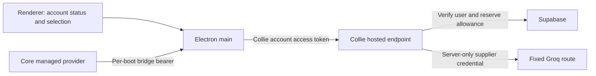

# Collie AI managed inference

Status: implemented, disabled by default; deployment and supplier onboarding are
not completed. This is a bounded text pilot alongside existing BYOK connections.

## Customer experience

Welcome and Settings offer **Collie AI**. When an endpoint is configured, the
customer signs in with their Collie account and can select included inference
without supplying a model-provider API key. Their existing providers remain
saved and can be selected explicitly. A build without an endpoint disables
activation. Sign-out, exhausted allowance, capacity errors, and unsupported
requests stop the hosted request; they never select a personal or paid provider.

The card displays remaining reservation units. These are conservative capacity
units, not money or exact model tokens. Grants have explicit expiry, no automatic
renewal, and no checkout. The schema supports free/plus entitlement labels, but
does not establish a subscription price or implement billing synchronization.
An operator must grant pilot access. There is no unlimited-use promise.

## Architecture and ownership

- `collie-ui/src/main/managed-inference.ts` forwards inference via the existing
  authenticated loopback keychain bridge. It resolves the account session in
  Electron main on each request; account tokens never enter renderer/core IPC.
  The HTTPS endpoint is a build-time `COLLIE_INFERENCE_URL`, not renderer input.
- `collie-core/collie_core/providers/managed.py` pins `collie-auto`, caps output
  at 1,024 tokens, uses Chat Completions streaming, and disables automatic error
  retries. Startup restores this provider without requiring a personal API key.
  The managed configuration does not inherit personal credentials or base URLs.
- `tools/inference/worker.mjs` validates the account online, accepts only text
  messages/function tools, reserves capacity, then streams the fixed supplier
  endpoint. It strips client upstream/model overrides and sanitizes failures.
  No arbitrary proxy, provider marketplace, or paid fallback is exposed.
- `tools/inference/schema.sql` contains a separate, manually applied backend
  schema. Tables are private and RLS-enabled; only service-role RPCs can read
  allowances or reserve them. The service key exists only in the hosted worker.
  Existing local SQLite provider records need no migration.

## Hard stops and accounting

Deployment requires `FREE_TIER_CONFIRMED=true` plus three server secrets:
`GROQ_API_KEY`, `SUPABASE_URL`, `SUPABASE_SERVICE_ROLE_KEY`. The committed
Wrangler configuration disables this flag and has no deployment route.
The database pool and individual grants are also disabled by default.

Admission locks the shared pool, checks request-ID uniqueness, and atomically
reserves both account and pool units before contacting the supplier. The same
request ID is not re-executed. A failed or disconnected attempt remains spent:
there is no optimistic refund or blind retry when upstream consumption is
uncertain. Requests store identity, request ID, units and timestamp, not prompts
or responses. Supplier/account-platform logging and retention require separate
verification; absence of application prompt logging is not a zero-retention
claim.

The initial route is `openai/gpt-oss-20b` on Groq. The pilot permits up to
6,000 reservation units per minute, 100,000 per UTC day across the whole service,
and 6,000 per request. Units include serialized UTF-8 message/tool bytes, 2,048
framing headroom, and the maximum output allowance. This is deliberately
conservative; it is not a provider-tokenizer or exact billing calculation.
Fixed minute windows also do not guarantee compliance with a supplier's rolling
window: a supplier 429 is a hard stop.

**Large agent contexts and tool catalogs will be rejected.** No real supplier
completion, full default agent workflow, tool quality, or production concurrency
has been validated. Before general release, benchmark real Collie contexts and
obtain adequate expressly free capacity or a separately authorized funding
model. Do not trim permission instructions or tool schemas to evade limits.

## Zero-cost onboarding and deployment gate

Creating a company organization and server credential for embedded customer
requests is distinct from redistributing a personal API key. No account signup,
terms acceptance, inference request, schema application, or deployment is
performed by this PR or its tests.

Before enabling:

1. Establish a Collie-owned supplier organization. Review the current
   [Groq terms](https://groq.com/terms-of-use/) and
   [rate limits](https://console.groq.com/docs/rate-limits), and verify that the
   free organization may serve Collie end users. Obtain written confirmation
   when the intended commercial use is not explicit.
2. Verify the chosen model has an ongoing free allocation and hard rejection
   at its limit. Do not add a card, buy credits, upgrade, enable auto-recharge,
   accept a minimum commitment, or rely on trial credits to satisfy zero cost.
   Dedicate the organization to this route or account for all other usage.
3. Independently verify the hosting and account/database projects have free
   hard stops. A free model does not make Worker or database infrastructure
   free. A project already on a paid plan is not acceptable under a zero-cost
   constraint merely because it has an included allowance.
4. Only after those checks, provision secrets, apply the schema as a separate
   change, grant a small expiring allowance, and enable the pool/worker.
   Point an explicitly configured desktop build at the controlled HTTPS route.
5. Validate streaming, disconnects, account expiry/revocation, quota saturation,
   realistic context size, and tool use with confirmed free capacity. Keep
   general customer rollout disabled until these checks pass.

The confirmation flag is an operator attestation, not a technical guarantee
about a provider's billing configuration. Local quota code cannot prevent a
supplier from charging an incorrectly configured account. If any zero-cost
condition cannot be verified, keep the service disabled.

## Local verification

- Core: managed provider, settings credential isolation, provider configuration,
  and IPC regression tests under `collie-core/tests/`.
- Desktop: managed card, main forwarding, authenticated keychain bridge,
  account auth, and Welcome tests; TypeScript check and production build.
- Worker: `node --test tools/inference/worker.test.mjs` uses mock network calls.
- Database: install `@electric-sql/pglite@0.3.14` in an ignored local directory,
  then run `node tools/inference/schema.test.mjs <path-to-pglite-package>`.
  This executes PostgreSQL functions and permission checks entirely in memory.
  It checks competing requests in PGlite's serialized executor; it does not
  replace hosted multi-connection/load testing.

No test requires a provider key, paid service, or external inference call.
